# GamerHub Agent 开发与闭环验收

本项目是本地 Unity 游戏创作 Agent。语言模型负责讨论与工具决策，Python 管理上下文、记忆和工具边界，Unity 负责实际执行和验收。生图是可选美术能力；不配置生图也能用内置素材走完整制作流程。

## 闭环和验收标准

1. 创建项目，多轮讨论玩法；项目记忆保存用户明确提出的约束。
2. 在素材工作室准备两组素材，选择其中一组。内置配色与外部生成明确标注来源；每组包含角色、场景、收集物、障碍四张图。
3. 生成制作说明并由用户确认。仅准备或选择素材不会启动 Unity 制作；变更素材后需要重新审阅方案。
4. Agent 执行确认的任务，通过受控工具编辑工程、编译、测试、试玩。失败信息回到修复循环，受阶段权限和预算限制。
5. 验收通过才发布 WebGL 试玩；失败不替换已发布版本。模型文字“完成”不能代替编译、测试和构建证据。
6. 用户试玩后提修改意见，再验证并发布新版本；恢复历史版本应使用对应 Spec、源码及素材哈希。

架构源文件：[agent-development.mmd](../architecture/agent-development.mmd)。现有 Agent 细节与历史证据见 [Agent 基础层](../../reports/agent-foundation.md)。历史报告不等于本机本次已通过验收。



## 开发职责与扩展位置

| 模块 | 入口 | 扩展时必须保留的契约 |
| --- | --- | --- |
| HTTP / 生命周期 | `apps/platform-fastapi/gamerhub_api/app.py`、`bridge.py` | 归属校验、稳定错误码、资源回收 |
| Agent 循环与上下文 | `gamerhub_api/pi/service.py`、`context.py`、`memory.py` | 输入预算、历史成组、记忆修订、官方 Pi 宿主 |
| 工具 | `gamerhub_api/pi/registry.py`、`tools.py` | Schema、允许阶段、超时、结果限制、幂等与恢复语义 |
| 图片 Provider | `gamerhub_api/providers.py` | 无密钥回显、显式来源、失败不回落、PNG/透明背景校验 |
| 素材任务 | `gamerhub_api/art.py`、`apps/local-dev/src/art-store.ts` | 两套四图上限、逐图断点、显式恢复、修订冲突、旧候选保留 |
| 游戏制作 | `packages/game-spec`、`packages/game-skills`、`apps/orchestrator-worker` | 注册能力、确认 Spec、依赖任务图、执行证据 |
| Unity 与版本 | `packages/unity-adapter`、`apps/local-dev/src/source-checkpoints.ts` | 真实编译测试、隔离工程、源码快照、回滚 |
| 创作界面 | `apps/studio-web/src/features` | 草案/已发布分离、实际步骤、失败可恢复 |

新增工具时先声明读写影响、参数和输出 Schema、允许阶段、超时及副作用恢复方式，再接处理器；不要让模型传入任意 shell 命令。新增玩法时同时扩展能力表、Spec、运行时、计划与断言，执行真实 Unity 验收后再对用户标记可制作。

## 启动和诊断

```powershell
pnpm install
pnpm setup:python
pnpm exec playwright install chromium
pnpm start:local --no-open
pnpm agent:doctor
```

`agent:doctor` 只读健康接口，不调用付费模型。它检查 FastAPI/Pi、真实 Unity 模式、PostgreSQL、对象存储和模型配置；Redis 仅在数据库轮询确实可用时允许降级。图片配置是可选项，缺失不阻断内置素材闭环。

```powershell
# 要求外部图片配置完整，但仍不发送图片请求
pnpm agent:doctor --require-image
```

“配置已检测”不代表远端账户有余额、模型权限或实际连通，也不代表 Unity 许可与构建已经通过。语言模型可用性继续用 `pnpm model:doctor` 检查；真实生图由工作台明确选择外部来源后触发。

启动器会在后台服务提前退出时立即指出日志位置。Studio 首次或输入发生变化时构建；后续启动会校验源码、工作区依赖、配置、锁文件、构建环境和生产输出的摘要，符合时复用构建。缓存记录位于 `artifacts/dev-tools/studio-build.json`，仅包含摘要；删除该记录可强制下次重新构建。缺文件、输出被修改、构建失败或构建期间源码变化都不会被误判为可复用。已运行的服务仍按健康检查复用，修改代码后需重启相应服务。

## 生图配置

配置写入 `.env.local` 后重启后端；不要把密钥放进浏览器环境变量或项目聊天。已有网关 URL 配置保持兼容。完整字段见 [.env.example](../../.env.example)。

默认内置模式无需图片 Key。直接接 OpenAI Images：

```dotenv
GAMERHUB_IMAGE_PROVIDER=openai
GAMERHUB_IMAGE_MODEL=<你的账户可用且支持透明 PNG 的 GPT Image 模型 ID>
GAMERHUB_IMAGE_API_KEY=<仅在本机填写>
GAMERHUB_IMAGE_QUALITY=medium
GAMERHUB_IMAGE_TIMEOUT_SECONDS=120
```

该适配器使用官方 `/v1/images/generations`，不与当前语言模型的 DeepSeek Key 混用。前景图要求透明背景；背景图使用非透明背景。不会自动抠图，也不会把不满足透明要求的素材当作成功。

模型能力与参数来源：[OpenAI Images API 官方规范](https://developers.openai.com/api/reference/resources/images/methods/generate)。支持列表位于 `providers.py` 的 `OPENAI_PNG_MODELS`；新增模型先核对透明 PNG 能力，再扩展请求契约测试，不根据模型名字猜测兼容性。

其他供应商通过现有网关接入：

```dotenv
GAMERHUB_IMAGE_PROVIDER=gateway
GAMERHUB_IMAGE_PROVIDER_URL=https://your-gateway.example/generate
GAMERHUB_IMAGE_PROVIDER_KEY=<网关鉴权，可选>
```

网关接收 `prompt`、`role`、`width`、`height`、`transparent`，返回 `{"mime_type":"image/png","bytes_base64":"..."}`。这是本项目网关契约，并不表示任意供应商原生 API 都兼容。

每次完整准备两组素材最多发起 **8 次图片请求**。流程先验证计划，随后逐张生成；遇错停止，不自动重试付费请求或改用内置图片冒充成功。候选记录 Provider、模型（配置有值时）、生成时间、资产 ID 和内容哈希，历史版本不依赖临时供应商下载链接。

## 素材进度和恢复

- 工作台显示已保存的 `n/8` 张以及当前正在生成的角色和配色。未完成的图片组只保存在任务断点中，全部完成后才成为可选候选。
- 失败、主动停止或服务重启后，点击“继续上次准备”使用原始描述、素材来源和已验证清单，只生成尚未保存到断点的图片。`POST /v1/projects/{projectId}/art/resume` 只接收 `{revision}`；每次恢复更新执行令牌，迟到的旧任务不能覆盖当前结果。
- “按当前描述重新准备两组”会创建新任务，最多重新请求 8 张图。页面输入按项目保存在当前浏览器，本地草稿只用于新任务；恢复任务不会采用刚编辑的文字。
- 更改 Provider、端点、模型或画质后，需要恢复原配置或新建任务；只轮换密钥不阻止恢复。8 张都保存、仅候选发布未完成时，不再要求生图服务可用。
- 素材已上传但保存断点临时失败时，会再尝试保存已有结果，不重复调用模型。但图片服务超时、连接中断，或上传成功与断点落库之间进程退出，仍可能存在已计费但未能确认的图片。恢复可能重发这些未确认请求；当前不承诺供应商计费的 exactly-once 语义。

断点随 `project_art_plans.document.generation` 保存在 PostgreSQL，旧项目无需迁移。每个已保存绑定仍验证项目归属、内容哈希和审核状态；活跃制作中的项目继续拒绝素材变更。界面空闲时每 10 秒同步，生成时每 2.5 秒同步；隐藏页面暂停轮询，返回立即刷新，单页不会重叠发送轮询。

## 分层验证

```powershell
# 不调用真实模型的代码门禁（Python、TypeScript、构建）
pnpm verify:agent

# 独立界面回归，使用受控 API 数据
pnpm test:ui

# 已启动真实数据库后的记忆/检查点隔离与恢复
$env:GAMERHUB_AGENT_PG_TEST='1'
pnpm test:fastapi
Remove-Item Env:GAMERHUB_AGENT_PG_TEST

# 保持本地服务运行：真实模型规划 + 3/8 中断重启 + 内置素材续跑
$env:GAMERHUB_ART_PG_TEST='1'
.venv/Scripts/python.exe -m pytest apps/platform-fastapi/tests/test_art_postgres.py -q
Remove-Item Env:GAMERHUB_ART_PG_TEST

# 实际模型 + 内置素材 + Unity：生成、修改素材、恢复版本
$env:GAMERHUB_REAL_FLOW='1'
pnpm test:flow art-creation-cycle.spec.ts
Remove-Item Env:GAMERHUB_REAL_FLOW
```

真实流程会创建独立验收项目、调用配置的语言模型并构建 Unity，运行时间明显长于单元测试。结果在 `artifacts/art-flow/`，Playwright 报告在 `artifacts/real-flow/`。默认素材测试不调用外部生图服务；Provider 的请求与失败契约由 Python HTTP 模拟测试覆盖，供应商实际画质与费用仍需配置后验证。

素材断点存储验收使用独立 owner，并保留验收项目、素材和 `artifacts/art-resume/verification.json` 供检查，不会出现在当前用户的项目列表中。它调用一次配置的语言模型规划，并验证 PostgreSQL 断点、MinIO 的 8 张图片及哈希；不构建 Unity、不调用外部生图。若已有素材正在生成，会拒绝开始验收，避免重启恢复逻辑干扰现有任务。`verify:agent` 始终清除以上真实验收开关。

CI 包含 Python 主后端、TypeScript、构建和界面回归；真实付费模型和 Unity 测试使用显式环境开关，不能把跳过当作真实通过。运行生产构建时应避开同一 Next.js 输出目录中的开发服务器。

离线集成测试也会使用本机 Chromium 检查浏览器试玩门禁；缺浏览器时先运行 `pnpm exec playwright install chromium`，Linux 可使用 `--with-deps` 安装系统依赖。

## 当前边界

- 四类已注册玩法（跑酷、幸存者、俯视射击、点击成长）是当前制作范围；通用任意游戏仍需新增运行时和验证。
- 图片模型只解决 2D 美术，不自动解决 3D 模型、骨骼动画、音乐或玩法正确性。
- 本地工作台可以运行真实闭环；公网多租户、独立作业调度、生产级素材扫描和商业 Unity 托管许可仍是部署扩展工作。
- CodeGraph 当前未安装且无索引；本轮依据已有明确入口实现。当前目录也没有 `.git`，代码版本管理应在纳入真实仓库后启用，未伪造提交或 PR。
