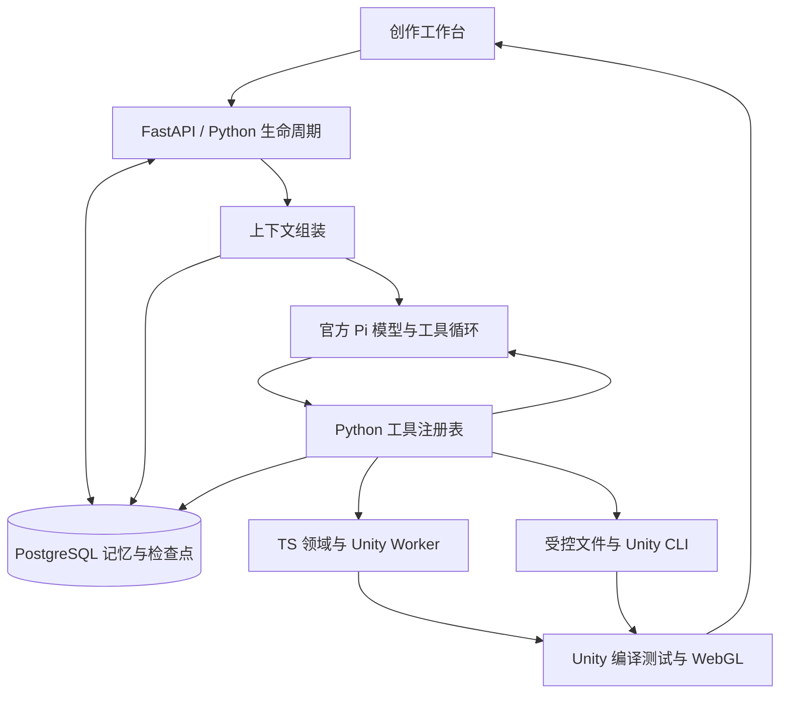

# Agent 上下文、记忆与工具架构

2026-09-08。Feature 007 已接入生产调用链路，完成真实模型、PostgreSQL、Unity 制作与浏览器通关验收。它是面向当前本地多项目应用的基础加固，尚不等同于通用商业游戏开发平台。

## 实际职责

| 层 | 当前实现 | 负责的事情 |
| --- | --- | --- |
| 创作工作台 | Next.js / ProjectMemory / AgentActivity | 多轮讨论、审阅确认、素材、记忆编辑删除、实际步骤与试玩 |
| HTTP 与生命周期 | Python FastAPI / PiService | 鉴权、项目上下文、工具分发、预算、中断清理与检查点 |
| Agent 循环 | 官方 Pi Agent Core 0.85.1，最小 Node 宿主 | 模型请求、工具调用、结果回灌、轮次控制 |
| 上下文 | Python ContextAssembler + 官方 transformContext | 每次请求前生成有界投影，不改原始会话 |
| 记忆与恢复 | Python AgentRepository / PostgreSQL | 用户记忆修订、来源、删除标记、最新检查点、CAS 与归属校验 |
| 工具 | Python ToolRegistry / WorkspaceTools | JSON Schema、阶段、超时、影响类别、输出限制、文件和 CLI |
| 游戏领域 | 现有 TypeScript 领域服务与 Worker | 已确认 Spec、任务图、素材、版本、测试评估和发布状态 |
| 引擎 | Unity Editor / batchmode CLI / WebGL | 实际编译、测试、工程生成、导出与试玩 |

官方 Pi 已有 AgentHarness、session 与 compaction 能力。本轮使用 Agent Core 和官方上下文钩子，由 Python 统一管理存储与恢复，避免两套控制器重复恢复同一次修改。没有把 Python 仿制循环称为官方 Pi，也没有把现有 TS 领域逻辑说成已经全部重写。



可编辑完整图见 [agent-foundation.mmd](agent-foundation.mmd)。图片导出服务与 CLI 依赖下载超时，保留 Mermaid 文本图；不影响应用与验收。

## 上下文如何组成

每次执行包含系统规则、当前确认任务、当前项目 Spec、有效用户记忆、已完成步骤、最近完整交互。设计侧不再先截取最后 24 条；全部历史交给 Python 按预算投影。

默认输入上限为 48,000 UTF-8 字节，包含系统提示、工具定义和任务资料。这是保守输入预算，不冒充精确 token 统计，另给模型输出留空间。先保留当前任务和全部必须遵守的约束，再保留最近完整会话组。一个助手工具批次和所有工具结果必须成组存在；遇到孤立结果直接失败，不向模型发送损坏历史。必需内容超预算时明确报错，不悄悄删掉用户约束。

较早历史保留在对话或私有检查点中，投影记录归档组数与 SHA-256 索引。该索引不是语义摘要，也不是新增长期事实。私有推理字段仅为供应商协议恢复而留在私有消息中，不进入记忆 API 或创作者步骤。

## 记忆的规则

- 用户明确保存的偏好、必须遵守的约束、已做决定才进入可编辑记忆；模型不能自行把猜测存成事实。
- 已确认制作说明、运行中已完成步骤动态读取，旧 Spec 不冒充当前方案。
- 每项目最多 200 条有效记录，每条最多 1200 字；另保留最多 200 条空内容删除标记。删除 ID 不能再次以更新方式复活。
- 修订采用 CAS，过期标签页返回 409，保留用户输入并重新加载；跨项目、跨 owner、错误 run 均先核对归属。
- 记忆检索按约束优先和中英文词项相关度排序。当前无需额外向量库；检索接口可以替换。
- 每次模型调用及工具执行前检查记忆修订。进行中被修改的旧上下文不会继续提交动作，需要按最新记忆重新发起。已经启动的 Unity 操作先在安全边界结束。
- 删除记忆不会删掉用户原始对话，也不会自动修改已经确认或发布的游戏。工作台明确说明这个边界。

## 工具与 CLI

统一注册的工具包括 `execute_action`、`workspace_list/read/search/write/log`、`cli_run`、`project_context`、`memory_search`。后两者不接受任意 projectId，始终绑定当前工程。`execute_action` 只执行当前确认动作；文件修复工具在失败后的修复阶段开放。

每个工具声明参数 Schema、允许阶段、影响类别、超时、输出字节上限和重放类别；Python 在执行前独立校验，未知字段、错误类型、越权阶段不会进入处理器。CLI 采用结构化 operation 与固定参数数组，不接收任意 shell 命令。

脚本按页读取，返回整文件 hash；写入需要 expectedHash、写前备份和原子替换。搜索范围只在本工程允许的 C# 脚本。CLI 失败保留 exitCode、timedOut、诊断和 logId，大输出裁剪后仍保留失败状态，日志可按编号继续分页读取。日志过滤当前机器目录和配置中的凭证值。

成功来自工具验收和已提交输出，模型说“完成”不算完成。执行前写入幂等账本，完成后保存结果；未知中断副作用要求核对，不盲目重放。Pi 宿主退出后，领域控制器会中止并等待正在运行的调用结算，再释放任务。

## 存储与迁移

新增迁移 `012_agent_foundation.sql`：`project_agent_memory` 保存项目记忆；`agent_checkpoints` 保存每个运行最新的完整私有检查点。旧 `agent.pi.checkpoint` 事件仍可读取；新运行只在事件日志写检查点修订引用，不反复复制整段历史。

PostgreSQL 仍是唯一事实源。每次事务设置 RLS 用户，并额外显式检查 owner/project/run，避免依赖超级用户角色下被绕过的 RLS。Windows 使用最多 4 连接的同步池和后台线程提供异步接口，查询上限 15 秒；连接上的操作结算后才回收。这样保留 Pi/Unity 子进程需要的事件循环。[Psycopg 官方兼容性说明](https://www.psycopg.org/psycopg3/docs/advanced/async.html)

## 验收证据

| 验证 | 结果 |
| --- | --- |
| Python，包括真实 PG 重启/CAS/归属隔离 | 35 通过 |
| TypeScript 单元、契约、集成回归 | 201 通过，3 项已有外部验收跳过 |
| UI 原有回归 + 新记忆编辑冲突/删除/移动端 | 16 + 1 通过 |
| Typecheck / Biome / Next 生产构建 | 通过 |
| 真实 Pi、真实模型、40 轮中文测试历史 | 裁掉 33 组，保留 8 组；43,689 / 48,000 字节；准确返回名称与记忆 ID |
| 真实页面 → 记忆修改删除 → 对话 → 确认 → Unity → 试玩 | 通过，浏览器实际通关 |
| 后端重启后记忆与检查点 | 记忆修订 4 保留；检查点修订 48，8 个动作完成 |

40 轮历史是用于边界测试的合成中文对话，发送给真实配置模型，并非 40 次人工聊天；Unity 流程使用真实的两轮设计对话，没有模型或引擎替身。

验收项目：`93bf052a-95ab-49ad-af67-0621eba12130`，Run：`000b7169-6fad-4006-ae5b-fdd96b410740`。原项目 `fb0a4c2b-c116-432b-8b96-337b21e00414` 及其发布版本保留。

证据：[完整流程](../artifacts/agent-foundation/browser-flow.json)、[长上下文与重启](../artifacts/agent-foundation/context-restart.json)、[记忆页面](../artifacts/agent-foundation/memory.png)、[实际通关](../artifacts/agent-foundation/game-won.png)。

本轮发现并修复：Windows 异步驱动不兼容；旧玩法提示让模型误把范围数组当数值；上下文预算错误被中断错误掩盖；借用数据库连接期间取消可能泄漏连接；Pi 退出时领域修改尚未结算。

SpecKit 收敛检查补齐了 T016：记忆创建时间、上下文 policyVersion/sourceHash、工具 version/evidenceKind 和错误元数据。新增字段测试先观察失败再通过；旧记录缺创建时间时返回 null，不伪造历史。旧006运行的8个已完成动作可以直接从历史检查点读取，没有改写原表或覆盖原构建。

## 复验

```powershell
pnpm setup:python
pnpm db:migrate
$env:GAMERHUB_AGENT_PG_TEST='1'
pnpm test:fastapi
pnpm test
pnpm test:ui
pnpm typecheck
pnpm lint
$env:GAMERHUB_REAL_FLOW='1'
pnpm exec playwright test --config playwright.flow.config.ts agent-foundation.spec.ts
.venv/Scripts/python.exe -X utf8 scripts/verify-agent-context.py
```

`verify-agent-context.py` 使用最近完整流程生成的验收项目；先完成该流程再运行。

## 能力边界

本轮提高的是上下文可靠性、项目记忆、工具约束和恢复能力。游戏制作仍由注册并验证的玩法模块组成；任意 3D、联机、大世界或全新复杂机制，还需要新增运行时、工具与验收。当前也没有跨项目共享记忆、向量语义检索、多用户公网部署或无人值守商业 SLA。这些是后续扩展，不是本轮已经完成的能力。
