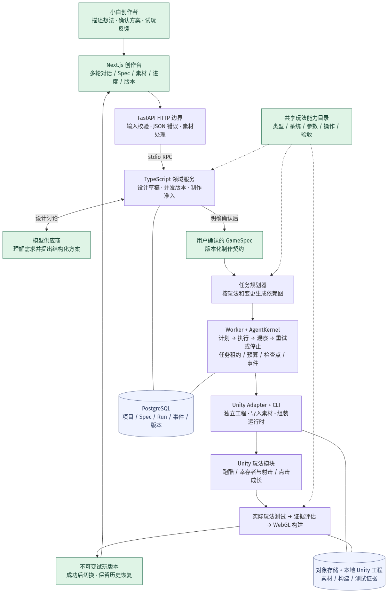

# GamerHub 多类型游戏 Agent：架构与实现边界

更新：2026-09-07。对应规格：`specs/005-multigenre-agent`。本报告描述当前运行代码；完整验收结果在文末记录。

## 为什么之前只能做猫咪跑酷

限制来自项目实现，不是语言模型无法讨论其他游戏。旧代码有三个相互加强的限制：

1. 设计助手的系统提示词要求拒绝战斗和其他类型，草案只保存跑酷数值。
2. `planRunnerTaskGraph` 忽略输入的玩法 Spec，始终排出角色、障碍、金币等固定任务。Schema 虽然列出其他 genre，也没有对应执行路径。
3. Unity 场景只挂载 Runner 管理器，验收只看 Runner 测试。换一个游戏名字不会改变玩法。

所以，原来的应用是“AI 讨论 + 固定跑酷工具流程”，并不是能独立实现任意游戏系统的通用开发 Agent。只删掉拒绝提示词，会让 AI 承诺实际做不出的东西。本轮同时改动设计契约、规划、Unity 运行时和验收。

## 当前分层

| 层 | 当前职责 | 主要代码 |
| --- | --- | --- |
| 创作页面 | 引导多轮对话，展示玩法、参数、素材来源、Spec、进度、试玩与历史版本 | `apps/studio-web/src/features/creator/GuidedStudio.tsx` |
| HTTP 后端 | FastAPI 接收请求、校验输入、输出统一 JSON 错误、处理素材图片；3001 为 API，3010 提供预览内容 | `apps/platform-fastapi/gamerhub_api/app.py`、`serve.py` |
| 领域与设计服务 | 草案版本、租户、并发保护、确认准入；调用模型形成结构化设计 | `apps/local-dev/src/rpc-server.ts`、`apps/platform-api/src/services/design-service.ts` |
| 玩法契约与规划 | GameSpec 描述类型、系统、参数、规则、素材和验收；共享目录决定可执行模块；规划依赖任务 | `packages/game-spec/src/game-capabilities.ts`、`packages/game-planner/src/planner.ts` |
| Agent 执行内核 | Worker 领取任务，AgentKernel 管理工具调用、预算、幂等、观察结果、有限重试、检查点及状态事件 | `apps/orchestrator-worker`、`packages/agent-runtime` |
| Unity 工具 | 创建/同步独立工程，导入素材和参数，选择运行时，调用 Unity CLI 测试与 WebGL 构建 | `apps/local-dev/src/real-unity.ts`、`packages/unity-adapter`、`unity/Packages` |
| 游戏运行与验收 | 真正的移动、攻击、伤害、经验、升级、收益、胜负和重玩；按玩法检查结果 | `unity/Templates/Runner/Assets/Game/Scripts`、`Assets/Tests/PlayMode` |

FastAPI 和 TypeScript 之间采用本地 stdio RPC。当前主链路没有 Fastify HTTP 转发：保留 TypeScript 是为了复用已经实现的领域与 Agent 内核，并不意味着外部后端仍是 Fastify。仓库中还有历史兼容服务和 Fastify 类型依赖，不能把“主要 HTTP 后端已迁移”说成“仓库所有代码都变成 Python”。

## 一次请求如何变成游戏

1. **讨论**：用户描述想法，设计伙伴结合现有草案和能力目录，讨论玩法、操作、目标、难度和美术。聊天保存草案，不会启动 Unity。
2. **准备 Spec**：用户选择生成制作说明。服务把结构化草案转成 GameSpec 与可读说明；记录当前基准版本和选定素材，避免确认过期方案。
3. **确认与准入**：用户确认后，检查运行时、必需系统和未解决的能力缺口，再创建带幂等键的 Run。没有对应运行时的想法仍能保存设计，不能伪装为已可制作。
4. **规划与执行**：Planner 根据 Spec 选择玩法及任务。Worker 执行任务图；AgentKernel 记录每步工具请求、结果和检查点。可重试的基础设施错误有有限重试，玩法/编译失败会明确停止。
5. **真实 Unity**：把参数写入 `Assets/Resources/GamerHubGameConfig.json`，同步对应代码与素材。场景根据 `runtime` 挂载实际游戏组件。`Runner.unity` 和模板目录名暂时保留为兼容入口，场景内容已能切换，名称并不代表始终运行跑酷。
6. **验收与发布**：运行对应 PlayMode 测试，检查成功状态、失败数和最低有效测试数，评估证据后构建 WebGL。发布成功才提升当前 Spec/试玩版本；失败保留上一版可玩结果。
7. **试玩再讨论**：网页展示已发布版本的操作指南。用户反馈后形成新草案与新版本，保留旧版本恢复路径。

PostgreSQL 保存项目、草案、Spec、Run、事件、检查点与版本。Redis 负责唤醒 Worker，持久领取状态仍由 PostgreSQL 控制。对象存储保存素材，独立 Unity 工程及不可变 WebGL 构建保存在本地。OTel 用于观测，不参与决定玩法是否成功。

## 本轮实际扩展的玩法

| 类型 | 执行模块 | 真正实现的循环 |
| --- | --- | --- |
| 横版跑酷 | `runner-v1` | 移动、跳跃、躲障碍、收集得分、倒计时通关 |
| 幸存者 | `arena-v1` | 俯视走位、敌人追踪、自动攻击、击杀掉经验、拾取升级、伤害/攻速/回血三选一、生命与计时胜负 |
| 俯视射击 | `arena-v1` | 与幸存者共用战斗系统，改为按住空格或射击按钮发动攻击，自动选取范围内最近目标 |
| 点击成长 | `clicker-v1` | 点击获得资源、购买强化、提高点击及自动收益、时限内达标、胜负与重玩 |

塔防、解谜、平台跳跃、飞行躲避、打砖块、RPG 对话及自定义创意可以讨论和保存；尚未实现对应运行时的，会显示具体缺口。不会擅自把它们改成猫咪跑酷。设计能力和已验证的执行能力是两个需要分别记录的状态。

幸存者是可玩的基础原型，尚无多武器组合进化、Boss、大世界或联网。射击采用自动选择目标，尚无鼠标自由瞄准。素材当前主要使用现有原创图形和配色；调整色调不能等同于生成了新的角色、动画或完整美术。

新增游戏界面已改为中文：开始、暂停、升级选择、费用提示、胜负与重玩。使用约 58KB 的 Noto Sans SC 字符子集，并随构建附带字体声明；子集缺少的自定义标题字形会使用通用玩法标题，创作台仍显示完整项目名。[字体来源与许可](https://github.com/google/fonts/tree/main/ofl/notosanssc)

## 为什么仍需要玩法模块，怎样继续扩展

Agent 提供“如何组织工作和处理结果”，不会自动补齐缺失的游戏代码。当前模型负责需求解释和设计，Planner/工具负责确定性的制作。现在依然**没有**让模型任意生成 C#、修改所有场景后自动调试到成功的通用编码循环。

本轮把原来的单一模板流程改成了明确的扩展点。新增玩法时，要一起接入：

1. 能力目录中的类型、必要系统、参数、操作和验收契约。
2. 草案到 GameSpec 的映射，以及创建/修改任务规划。
3. Unity 的实际组件或系统，并从确认的 Spec 读取参数。
4. 能证实核心循环的玩法测试、失败/重玩、修改与恢复测试。
5. 前端指导、素材语义与可执行状态，最后通过真实浏览器流程。

如果产品下一阶段要做到“用户自由描述、Agent 自己补齐新系统”，需要进一步增加受限代码编辑工具、工程级上下文检索、编译诊断回传、测试驱动修复循环和新能力验收。那是明确的后续架构工作，不能用多放几个 genre 枚举来冒充。

## 验证记录

- 真实 Unity：最终 PlayMode 合计16项通过（Arena10、Clicker4、旧Runner2），包括中文字体字形检查，证据 `artifacts/multigenre-all-playmode.xml`。
- 前端：16 项通过，涵盖多类型指南、未接入类型禁止制作、多轮确认、恢复状态和移动布局。
- 修复真实模型截断：旧预算 4,096 token 被推理占满，`finishReason=length` 且正文为空；多类型设计额度提高到 12,288，重新验证完整 JSON。
- 冷启动与重复启动通过；补齐 Windows 启动入口的错误码传递，避免失败后被 `pause` 覆盖。
- 真实浏览器发现并修复点击成长弹窗下面按钮抢点击，以及连续收集时误触胜利弹窗重玩的两个问题；这也是不能把“自动化游戏逻辑测试通过”等同于“完整用户体验已通过”的具体例子。
- 点击成长的Spec补齐超时失败规则；战斗与经验配置拒绝未实现的键和超出范围的数值，避免仅保存到文档却不执行。
- 浏览器端真实 AI → Spec → Unity → 玩法升级 → 修改 → 点击成长 → 恢复幸存者：通过，见 `artifacts/multigenre/cycle.json`（status=passed）。首次伤害2→升级3，修改后初始3→升级4，恢复后仍为3→4；点击收益10→20、自动收益0→2/秒，累计资源超过300后进入won，连续点击仍保留胜利状态。
- 主要成功Run：幸存者`1aa194d2-e85d-4b14-a793-bd4c28f28446`，修改`ff58aa84-17e8-4a32-9d93-2ad2abe7d9f1`，最终点击`28e6b653-38aa-4a86-bf60-a32009df3e02`，跨类型恢复`5cdbdcf4-1a1f-4b5b-bdbb-970a69917866`。中途自动化脚本使用错误版本状态名(current/active)及真实界面失败均有保留证据，修复后继续验证；未将首轮失败隐藏成一次通过。
- 旧Runner兼容恢复：`7c3fe75d-1659-465b-985b-38d44d1f7f54`重新构建旧版本并在浏览器开始/跳跃，随后`07fa3eeb-f904-4808-9d8c-a93d9fdc3366`再次恢复幸存者成功。见 `artifacts/multigenre/legacy-restore.json`。
- 最终代码门禁：TypeScript 198项通过、3项需额外条件而跳过；FastAPI 11项；UI 16项（后续多类型定向2项再次通过）；lint、typecheck、Next生产构建通过。完整跨类型流程及旧版本兼容流程各自通过。
- 最终真实对话确认不产生新Run，草案与已发布幸存者一致；浏览器无异常，390px手机布局没有横向溢出。证据 `artifacts/multigenre/final-ui.json`，最终页面截图 `studio-final-desktop.png` / `studio-final-mobile.png`。新玩法试玩引导使用中文「开始游戏」，旧Runner保留实际START按钮说明。

当前项目：`700cbd86-b364-4e9b-a978-ff6d7460804f`，当前试玩已恢复为幸存者。只读证据与截图均在 `artifacts/multigenre`；这批测试验证上述核心原型，不代表商业游戏完整性、全平台性能或所有设计类型均已具备执行能力。
